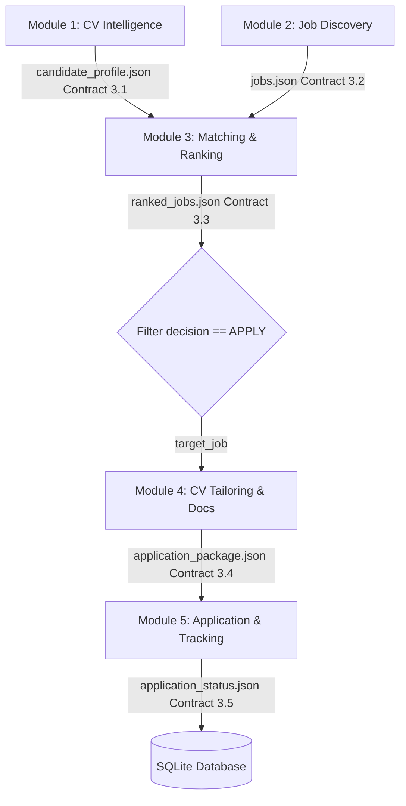

# Milestone 6 (M6) Requirements Checklist - System Integration & Orchestration

This document outlines the implementation requirements, contract boundaries, expected inputs/outputs, and tests for **Milestone 6: Final System Integration**.

---

## 1. Requirements Checklist

- **[ ] E2E Orchestrator Workflow (`Complete_Job_Hunter.json`)**
  - Must visually orchestrate all 5 modules sequentially or in parallel.
  - Passes outputs of preceding modules as inputs to subsequent modules.
  - Implements a looping/filtering mechanism to execute Document Tailoring (M4) and Application Tracking (M5) only for jobs marked with decision `APPLY`.
- **[ ] Real n8n Integration Boundary**
  - Frontend dashboard triggers orchestration through the Express server backend proxying to the n8n webhook url.
  - Express backend does NOT fake E2E orchestration via `runM6WorkflowSim()`.
  - Endpoint `GET /api/n8n/status` checks n8n online connectivity and reports it to the UI.
- **[ ] Data Contract Validation**
  - Ensures data is passed cleanly between modules without ad-hoc mutations.
  - Validates `candidate_profile.json` (Contract 3.1) flows into M3.
  - Validates `jobs.json` (Contract 3.2) flows into M3.
  - Validates `ranked_jobs.json` (Contract 3.3) flows into M4.
  - Validates `application_package.json` (Contract 3.4) flows into M5.
  - Validates `application_status.json` (Contract 3.5) is returned at final persistence.
- **[ ] Dashboard Orchestration Controls**
  - Add n8n pipeline triggers and status indicators on the Overview Dashboard.
  - Display step-by-step pipeline state and active executions.
  - Display helpful step-by-step instructions on setting up, launching, and importing workflows if n8n is offline.
- **[ ] E2E Regression Tests**
  - Run all previous test suites (M1–M5) and verify no regressions exist.
  - Create `data/test_data/test_m6.js` to execute an integration verification check validating the sequential data flows between the contracts.

---

## 2. Dependencies and Data Flows

---

## 3. Testing and Demonstration Scenarios

### E2E Integration Test Suite
Verify that Contract validation remains active across all boundaries.
- **Scenario A (Happy Path)**:
  - Input CV + Job Search terms.
  - M1 parses candidate.
  - M2 retrieves jobs.
  - M3 ranks candidate and jobs, recommending `APPLY` for a target vacancy.
  - M4 tailors resume.
  - M5 triggers approval, mock portal submission succeeds, and db updates status to `submitted`.
- **Scenario B (Portal Error Path)**:
  - Vacancy has `job_id = "job_error_500"`.
  - Pipeline executes, M5 fails portal upload and updates status to `failed`.
- **Scenario C (Offline n8n Path)**:
  - n8n is offline, frontend correctly shows warning and guidance.
